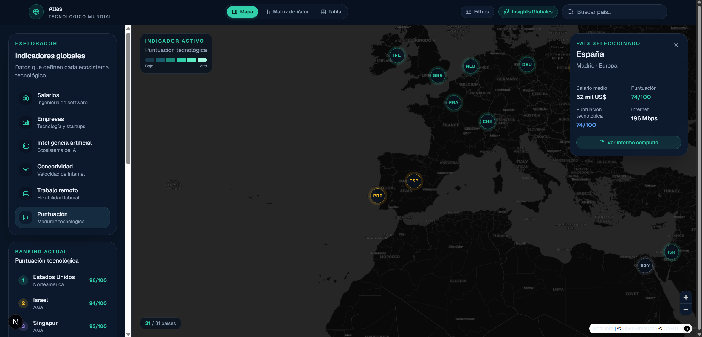
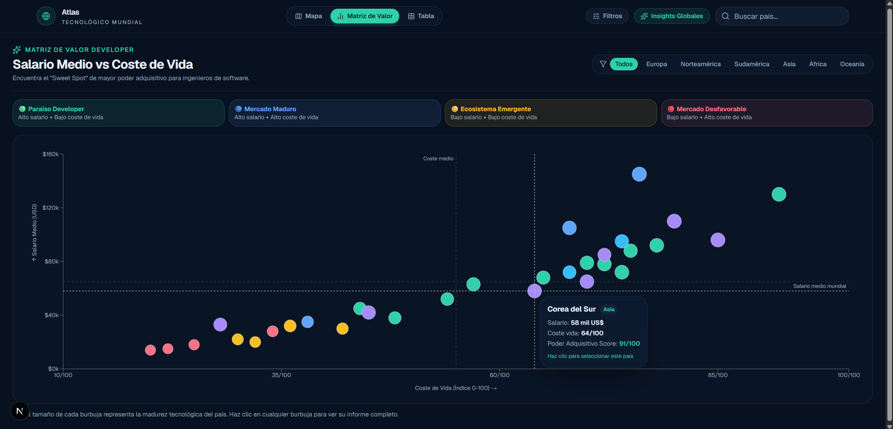
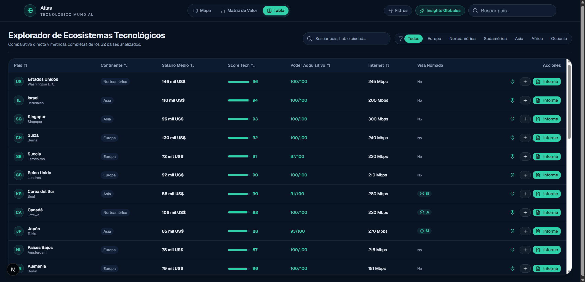
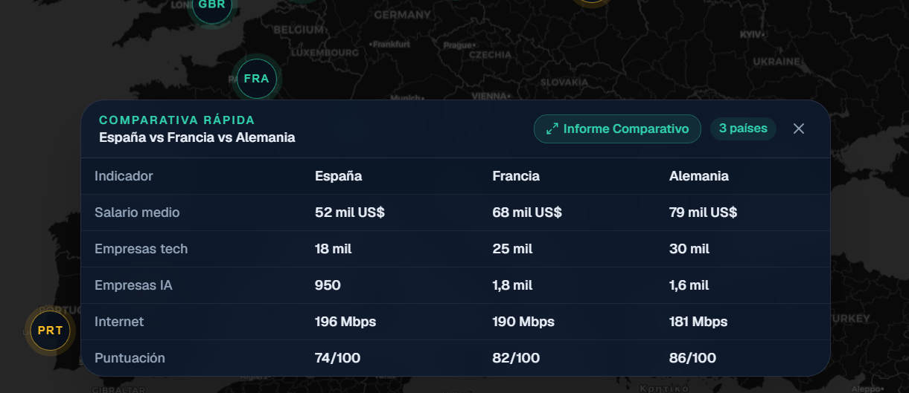
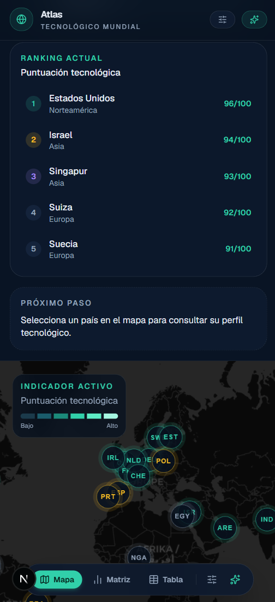

# 🌍 Atlas Tecnológico Mundial

> Plataforma web interactiva para explorar y comparar ecosistemas tecnológicos, salarios de ingeniería de software y hubs de innovación en **32 países del mundo**.

[](https://nextjs.org/)
[](https://react.dev/)
[](https://www.typescriptlang.org/)
[](https://tailwindcss.com/)
[](https://maplibre.org/)

---

## 🚀 Demo

**Producción (Vercel):** [Atlas Tecnológico Mundial](https://atlas-tecnologico-mundial.vercel.app)

Para ejecutar localmente:

```bash
git clone https://github.com/aadrigaar/Atlas_Tecnologico_Mundial.git
cd Atlas_Tecnologico_Mundial
npm install
npm run dev
```

Abre [http://localhost:3000](http://localhost:3000) en tu navegador.

---

## 📸 Capturas de pantalla

### 🗺️ Mapa principal

Mapa coroplético mundial con indicadores tecnológicos, ranking, selección de países e información contextual.



### 📊 Informe de país

Ficha detallada de cada ecosistema tecnológico con métricas, salarios, empresas, hubs tecnológicos y calidad de vida.


### 📈 Matriz de valor

Comparativa visual entre salario medio y coste de vida para identificar los ecosistemas con mayor poder adquisitivo.



### 📋 Tabla de ecosistemas

Tabla interactiva con búsqueda, ordenación, filtros y acceso directo a las diferentes acciones de cada país.



### ⚖️ Comparador de países

Comparación de hasta tres ecosistemas tecnológicos mediante métricas y visualizaciones comparativas.



### 📱 Diseño responsive

Interfaz adaptada a dispositivos móviles con navegación inferior y acceso a las principales funcionalidades.



---

## ✨ Funcionalidades principales

### 🗺️ Mapa Coroplético Interactivo

- Mapa mundial oscuro con **MapLibre GL** y estilo CARTO Dark Matter.
- Capa GeoJSON que colorea cada país según el indicador seleccionado: salarios, empresas tech, IA, conectividad, trabajo remoto o puntuación tecnológica.
- Hover reactivo sobre polígonos con iluminación de frontera.
- Marcadores personalizados con nivel visual (`alto`, `medio`, `bajo`).
- Tarjeta flotante del país seleccionado con acceso rápido al informe.
- Filtrado reactivo: los marcadores se actualizan en tiempo real con los filtros activos.

### 📋 Informe Extendido de País

Modal con **4 pestañas** por país:

1. **Vista General** — Puntuación tecnológica, poder adquisitivo, radar chart del perfil.
2. **Salarios por Experiencia** — Desglose Junior / Mid / Senior / Lead con gráfica de barras.
3. **Hubs & Empresas** — Ciudades tecnológicas y empresas emblemáticas.
4. **Calidad de Vida & Remoto** — Internet, trabajo remoto y visa nómada digital.

### 📊 Matriz de Poder Adquisitivo

Scatter plot que cruza **Salario Medio** vs **Coste de Vida** y clasifica los países en 4 cuadrantes:

- 🟢 **Paraíso Developer** — Alto salario, bajo coste
- 🔵 **Mercado Maduro** — Alto salario, alto coste
- 🟡 **Ecosistema Emergente** — Bajo salario, bajo coste
- 🔴 **Mercado Desfavorable** — Bajo salario, alto coste

### ⚖️ Comparador Avanzado

Comparación simultánea de hasta **3 países** con radar chart superpuesto, gráfica de salarios por seniority y tabla de 12 métricas.

### 🎛️ Filtros Avanzados

Panel con sliders de salario mínimo, velocidad de internet y puntuación tecnológica, más toggle de visa nómada digital. Contador de resultados en tiempo real.

### 📋 Tabla de Ecosistemas

Búsqueda en vivo, ordenación multi-columna y filtros rápidos por continente.

### ⌨️ Atajos de Teclado

| Tecla    | Acción                |
| -------- | --------------------- |
| `1`      | Vista Mapa            |
| `2`      | Vista Matriz de Valor |
| `3`      | Vista Tabla           |
| `Escape` | Cerrar modal activo   |

---

## 🛠️ Tecnologías

| Tecnología      | Versión    | Uso                                           |
| --------------- | ---------- | --------------------------------------------- |
| Next.js         | 16         | Framework con App Router y Turbopack          |
| React           | 19         | Biblioteca de interfaz de usuario             |
| TypeScript      | 5 (Strict) | Tipado estático en todo el proyecto           |
| Tailwind CSS    | v4         | Estilos utilitarios y sistema de tokens       |
| shadcn/ui       | 4.x        | Componente base `Button`                      |
| MapLibre GL     | 6.x        | Motor de mapas interactivos (sin API key)     |
| Recharts        | 3.x        | Gráficos: Scatter, Bar, Radar, Pie            |
| Framer Motion   | 13         | Animaciones y transiciones declarativas       |
| Lucide Icons    | 1.x        | Iconos vectoriales                            |

---

## 🏗️ Arquitectura

```
src/
├── app/
│   ├── globals.css          # Tokens de color, estilos del mapa y marcadores
│   ├── layout.tsx           # Metadata SEO, Open Graph, Twitter Cards, fuentes
│   ├── loading.tsx          # Pantalla de carga (Next.js App Router)
│   ├── not-found.tsx        # Página 404 personalizada
│   └── page.tsx             # Orquestador principal: estado global y vistas
├── components/
│   ├── graficos/
│   │   ├── matriz-poder-adquisitivo.tsx   # Scatter plot (Recharts)
│   │   └── radar-perfil-tecnologico.tsx   # Radar chart del perfil tecnológico
│   ├── layout/
│   │   ├── cabecera-principal.tsx         # Header: navegación, buscador y acciones
│   │   ├── modal-estadisticas-globales.tsx# Panel de analítica global
│   │   ├── navegacion-inferior-movil.tsx  # Barra flotante de navegación móvil
│   │   └── panel-explorador.tsx           # Sidebar: indicadores, ranking y resumen
│   ├── mapa/
│   │   └── mapa-mundial.tsx               # MapLibre GL, GeoJSON coroplético, marcadores
│   ├── paises/
│   │   ├── buscador-paises.tsx            # Input de búsqueda con autocompletado
│   │   ├── comparador-paises.tsx          # Comparativa rápida flotante (≥2 países)
│   │   ├── modal-comparador-avanzado.tsx  # Modal comparador completo (hasta 3 países)
│   │   ├── modal-informe-pais.tsx         # Modal de informe con 4 pestañas
│   │   ├── panel-filtros-avanzados.tsx    # Panel de filtros avanzados
│   │   ├── ranking-paises.tsx             # Top 5 por indicador activo
│   │   ├── resumen-pais.tsx               # Tarjeta de resumen del país seleccionado
│   │   └── tabla-paises.tsx               # Tabla interactiva con búsqueda y ordenación
│   └── ui/
│       ├── button.tsx                     # Componente Button (shadcn/ui)
│       └── notificacion-toast.tsx         # Notificaciones toast (Framer Motion)
├── data/
│   └── paises.ts            # Dataset estático tipado de 32 países
└── types/
    ├── indicador.ts          # Tipo IndicadorMapa (union type)
    └── pais.ts               # Tipos Pais, EcosistemaPais, DesgloseSalarios
                              # + función calcularPoderAdquisitivo()
```

**Patrón de estado:** Todo el estado reside en `page.tsx` y se pasa hacia abajo mediante props. Sin Context API ni gestores de estado externos. Simple, predecible y fácil de explicar.

---

## 📊 Datos

**Los datos son estáticos y están definidos en TypeScript** en `src/data/paises.ts`.

El dataset cubre **32 países de 6 continentes** con las siguientes métricas por país:

| Campo                    | Descripción                                           |
| ------------------------ | ----------------------------------------------------- |
| `salarioMedioUsd`        | Salario anual estimado en software engineering (USD)  |
| `empresasTecnologicas`   | Número aproximado de empresas del sector tech         |
| `empresasIa`             | Número aproximado de empresas de IA                   |
| `costeDeVida`            | Índice de coste de vida (0–100)                       |
| `velocidadInternetMbps`  | Velocidad media de conexión a internet                |
| `trabajoRemoto`          | Índice de adopción de trabajo remoto (0–100)          |
| `puntuacionTecnologica`  | Puntuación global de madurez tecnológica del país     |

Cada país incluye también: hubs principales, empresas destacadas, visa nómada digital, tipo impositivo aproximado y desglose salarial por seniority.

> **Nota:** Los datos son representativos para demostración técnica. No provienen de una API en tiempo real.
>
> La estructura de tipos está diseñada para que sustituir el dataset estático por una fuente de datos externa sea un cambio mínimo y localizado en `src/data/paises.ts`.

---

## 🧠 Decisiones técnicas

### ¿Por qué Next.js con App Router?

Permite generar páginas estáticas sin servidor, integra `next/font` para optimizar las fuentes y el sistema de `metadata` de React 19 simplifica el SEO sin librerías adicionales.

### ¿Por qué TypeScript en modo estricto?

Los tipos `Pais`, `EcosistemaPais`, `DesgloseSalarios` e `IndicadorMapa` garantizan coherencia entre el dataset y los props de los componentes, eliminando errores en tiempo de ejecución y facilitando el mantenimiento.

### ¿Por qué MapLibre GL?

Es el fork open-source de Mapbox GL JS. Renderiza mapas con aceleración GPU, soporta capas GeoJSON dinámicas (la base del mapa coroplético) y no requiere API key para el estilo CARTO Dark Matter.

### ¿Por qué Recharts?

Integración declarativa con React, soporte completo para Scatter, Radar, Bar y Pie charts con props tipadas, sin manipulación directa del DOM.

### ¿Por qué datos estáticos?

- Respuestas instantáneas, sin latencia de red.
- Sin dependencias de APIs externas que puedan cambiar o caer.
- El proyecto demuestra arquitectura y diseño de interfaz. La conexión a una API real es un cambio de una sola capa.

---

## 💻 Instalación

```bash
# Clonar el repositorio
git clone https://github.com/aadrigaar/Atlas_Tecnologico_Mundial.git
cd Atlas_Tecnologico_Mundial

# Instalar dependencias
npm install

# Iniciar servidor de desarrollo
npm run dev
```

---

## 📜 Scripts disponibles

| Script                 | Descripción                                     |
| ---------------------- | ----------------------------------------------- |
| `npm run dev`          | Servidor de desarrollo con Turbopack            |
| `npm run build`        | Build de producción                             |
| `npm run start`        | Servidor de producción local                    |
| `npm run lint`         | Auditoría ESLint                                |
| `npm run lint:fix`     | Corrección automática de ESLint                 |
| `npm run format`       | Formateado con Prettier                         |
| `npm run format:check` | Verificación de formato sin modificar archivos  |

---

## ♿ Accesibilidad

- Todos los botones interactivos tienen `aria-label` descriptivo.
- Los modales usan `role="dialog"`, `aria-modal="true"` y `aria-label`.
- El buscador implementa el patrón `combobox` con `aria-expanded` y `aria-controls`.
- Los elementos de navegación activos usan `aria-current="page"`.
- Los íconos decorativos tienen `aria-hidden="true"`.
- Los inputs del buscador tienen etiqueta asociada (`sr-only label`).
- Cierre de modales mediante tecla `Escape`.
- Foco visible en todos los elementos interactivos.

---

## 📱 Responsive

| Dispositivo              | Experiencia                                                           |
| ------------------------ | --------------------------------------------------------------------- |
| Móvil (< 768px)          | Navegación flotante inferior, vistas en pantalla completa             |
| Tablet (768px–1024px)    | Sidebar colapsado, mapa en pantalla completa con tarjeta flotante     |
| Portátil (1024px–1440px) | Sidebar lateral + mapa, modales centrados                             |
| Escritorio (> 1440px)    | Layout completo con máximo de 1600px de ancho                         |

---

## 🔮 Roadmap

- [ ] Integración con APIs de datos reales (Numbeo, Bureau of Labor Statistics).
- [ ] Ampliación a 60+ países con mayor cobertura continental.
- [ ] Gráficos de tendencia histórica de salarios por año.
- [ ] Exportación de informes comparativos en PDF.

---

## 👤 Autor

**Adrián García Arranz**

- 🎓 Graduado en Ingeniería Informática
- 💼 Buscando primer puesto como Software Engineer / Full Stack Junior
- 🐙 GitHub: [aadrigaar](https://github.com/aadrigaar)
- 🔗 LinkedIn: [Adrián García Arranz](https://www.linkedin.com/in/adrian-garcia-arranz/)
- 📧 Email: adrigar1111@gmail.com

---

_Desarrollado para demostrar capacidad técnica real: arquitectura limpia, TypeScript estricto, diseño visual premium y experiencia de usuario cuidada._
