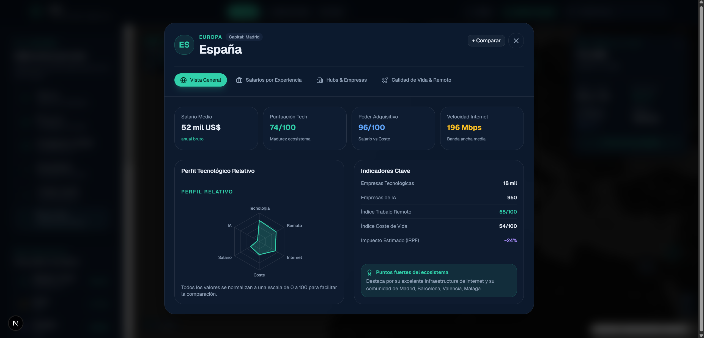

# 🌍 Atlas Tecnológico Mundial

> **Plataforma web interactiva para explorar y comparar ecosistemas tecnológicos, salarios de ingeniería de software, poder adquisitivo y hubs de innovación en 32 países del mundo.**

[](https://nextjs.org/)
[](https://react.dev/)
[](https://www.typescriptlang.org/)
[](https://tailwindcss.com/)
[](https://maplibre.org/)
[](https://www.framer.com/motion/)

---

## 🚀 Demo

> **URL de producción (Vercel):** _Añadir URL tras despliegue_

---

## 📸 Capturas

> Las capturas se encuentran en [`docs/screenshots/`](./docs/screenshots/).
> Si estás viendo este README en GitHub y las capturas no aparecen aún, consulta la sección [Capturas pendientes](#capturas-pendientes) al final de este README.

| Vista                                                   | Descripción                                             |
| ------------------------------------------------------- | ------------------------------------------------------- |
|         | Mapa coroplético mundial con indicadores seleccionables |
|  | Modal de informe extendido con 4 pestañas               |
|        | Scatter plot de poder adquisitivo vs coste de vida      |
|    | Tabla interactiva con búsqueda y ordenación             |
|         | Comparador avanzado de hasta 3 países                   |
|             | Navegación flotante adaptada a móvil                    |

---

## ✨ Características

### 🗺️ Mapa Coroplético Interactivo

- Mapa mundial oscuro basado en **MapLibre GL** con estilo **CARTO Dark Matter**.
- Capa GeoJSON (Natural Earth) que colorea dinámicamente cada país según el indicador seleccionado: salarios, empresas tech, empresas de IA, velocidad de internet, trabajo remoto o puntuación tecnológica.
- Hover reactivo sobre polígonos GeoJSON con iluminación de frontera.
- Marcadores personalizados con escala visual de nivel (`alto`, `medio`, `bajo`).
- Tarjeta flotante del país seleccionado con acceso rápido al informe completo.
- Filtrado reactivo: los marcadores responden en tiempo real a los filtros activos.

### 📋 Informe Extendido de País

Modal detallado con **4 pestañas**:

1. **Vista General** — Puntuación tecnológica, poder adquisitivo calculado, radar chart del perfil y puntos fuertes del ecosistema.
2. **Salarios por Experiencia** — Desglose por seniority (Junior, Mid, Senior, Lead/Architect) con gráfica de barras y estimación neta tras impuestos.
3. **Hubs & Empresas** — Principales ciudades tecnológicas y empresas emblemáticas del país.
4. **Calidad de Vida & Remoto** — Velocidad de internet, porcentaje de adopción de trabajo remoto y disponibilidad de visa nómada digital.

### 📊 Matriz de Poder Adquisitivo

Scatter plot (Recharts) que cruza **Salario Medio USD** vs **Coste de Vida** y clasifica automáticamente los países en 4 cuadrantes:

- 🟢 **Paraíso Developer** — Alto salario, bajo coste de vida.
- 🔵 **Mercado Maduro** — Alto salario, alto coste de vida.
- 🟡 **Ecosistema Emergente** — Bajo salario, bajo coste de vida.
- 🔴 **Mercado Desfavorable** — Bajo salario, alto coste de vida.

### ⚖️ Comparador Avanzado Multipaís

Comparación simultánea de hasta **3 países**:

- Radar chart superpuesto con 6 dimensiones.
- Gráfica de salarios por seniority lado a lado.
- Tabla de 12 métricas con identificación del país ganador.
- Exportación del informe al portapapeles.

### 📊 Insights Globales

Panel de métricas agregadas del ecosistema mundial:

- Salario medio global en software engineering.
- Gráfico donut de distribución de empresas tech por continente.
- Ranking de países líderes en salario y velocidad de internet.

### 📋 Tabla de Ecosistemas

- Búsqueda en vivo por país, capital o hub tecnológico.
- Ordenación multi-columna (salario, puntuación, poder adquisitivo, internet, etc.).
- Filtros rápidos por continente.
- Estado vacío con opción de limpiar filtros.
- Acciones rápidas: ver en mapa, añadir a comparación, abrir informe.

### 🎛️ Filtros Avanzados

Drawer de filtros con:

- Slider de salario mínimo.
- Slider de velocidad mínima de internet.
- Slider de puntuación tecnológica mínima.
- Toggle de visa para nómadas digitales.
- Contador de resultados en tiempo real.
- Filtros activos reflejados en la cabecera y en el mapa.

### 📱 Responsive & Móvil

- Navegación flotante inferior adaptada a dispositivos táctiles.
- Modos de vista accesibles desde móvil: Mapa, Matriz, Tabla.
- Accesos directos a Filtros e Insights desde la barra móvil.

### ⌨️ Atajos de Teclado

| Tecla    | Acción                |
| -------- | --------------------- |
| `1`      | Vista Mapa            |
| `2`      | Vista Matriz de Valor |
| `3`      | Vista Tabla           |
| `Escape` | Cerrar modal activo   |

---

## 🛠️ Tecnologías

| Tecnología                                      | Versión    | Uso                                        |
| ----------------------------------------------- | ---------- | ------------------------------------------ |
| [Next.js](https://nextjs.org/)                  | 16         | Framework React con App Router y Turbopack |
| [React](https://react.dev/)                     | 19         | Biblioteca de interfaz de usuario          |
| [TypeScript](https://www.typescriptlang.org/)   | 5 (Strict) | Tipado estático en todo el proyecto        |
| [Tailwind CSS](https://tailwindcss.com/)        | v4         | Estilos utilitarios y sistema de tokens    |
| [shadcn/ui](https://ui.shadcn.com/)             | 4.x        | Componentes base (Button, etc.)            |
| [MapLibre GL](https://maplibre.org/)            | 6.x        | Motor de mapas vectoriales interactivos    |
| [Recharts](https://recharts.org/)               | 3.x        | Gráficos (Scatter, Bar, Radar, Pie, Donut) |
| [Framer Motion](https://www.framer.com/motion/) | 13         | Animaciones y transiciones de UI           |
| [Lucide Icons](https://lucide.dev/)             | 1.x        | Iconos vectoriales                         |

---

## 🏗️ Arquitectura

```
src/
├── app/
│   ├── globals.css        # Tokens de color Oklch, estilos del mapa y marcadores
│   ├── layout.tsx         # Metadata SEO, Open Graph, Twitter Cards, fuentes Geist
│   ├── loading.tsx        # Pantalla de carga (Next.js App Router)
│   ├── not-found.tsx      # Página 404 personalizada
│   └── page.tsx           # Orquestador principal: estado global, vistas y modales
├── components/
│   ├── graficos/
│   │   ├── matriz-poder-adquisitivo.tsx   # Scatter plot (Recharts)
│   │   └── radar-perfil-tecnologico.tsx   # Radar chart de perfil tech
│   ├── layout/
│   │   ├── cabecera-principal.tsx         # Header: nav, buscador, filtros, insights
│   │   ├── modal-estadisticas-globales.tsx# Panel de analítica global
│   │   ├── navegacion-inferior-movil.tsx  # Barra de navegación flotante móvil
│   │   └── panel-explorador.tsx           # Sidebar: indicadores, ranking y resumen
│   ├── mapa/
│   │   └── mapa-mundial.tsx               # MapLibre GL, GeoJSON coroplético, marcadores
│   ├── paises/
│   │   ├── buscador-paises.tsx            # Input de búsqueda con autocompletado
│   │   ├── comparador-paises.tsx          # Comparativa rápida flotante (≥2 países)
│   │   ├── modal-comparador-avanzado.tsx  # Modal comparador completo (hasta 3 países)
│   │   ├── modal-informe-pais.tsx         # Modal de informe extendido con 4 pestañas
│   │   ├── panel-filtros-avanzados.tsx    # Drawer de filtros avanzados
│   │   ├── ranking-paises.tsx             # Top 5 por indicador activo
│   │   ├── resumen-pais.tsx               # Tarjeta de resumen del país seleccionado
│   │   └── tabla-paises.tsx               # Tabla interactiva con búsqueda y ordenación
│   └── ui/
│       ├── button.tsx                     # Componente Button (shadcn/ui)
│       └── notificacion-toast.tsx         # Notificaciones toast (Framer Motion)
├── data/
│   └── paises.ts          # Dataset estático de 32 países y 6 continentes
└── types/
    ├── indicador.ts        # Tipo IndicadorMapa (union type)
    └── pais.ts             # Interfaces Pais, EcosistemaPais, DesgloseSalarios
                            # + función calcularPoderAdquisitivo()
```

**Patrón de estado:** Todo el estado de la aplicación reside en `src/app/page.tsx` y se pasa hacia abajo mediante props. No se usa Context API ni gestores de estado externos, lo que mantiene el código sencillo y explicable.

---

## 🧠 Decisiones Técnicas

### ¿Por qué Next.js?

Next.js con App Router permite generar páginas estáticas (`output: "export"` compatible), lo que significa que la aplicación se despliega en Vercel sin necesidad de servidor. La integración con `next/font` y el sistema de `metadata` de React 19 simplifica el SEO sin librerías adicionales.

### ¿Por qué TypeScript estricto?

Todo el proyecto usa TypeScript en modo estricto (`strict: true`). Los tipos `Pais`, `EcosistemaPais`, `DesgloseSalarios` e `IndicadorMapa` garantizan que los datos del dataset y los props de los componentes sean siempre coherentes. Esto elimina una clase entera de errores en tiempo de ejecución y hace que el código sea más explicable en una entrevista técnica.

### ¿Por qué MapLibre GL?

MapLibre GL es el fork open-source de Mapbox GL JS. Permite renderizar mapas vectoriales con aceleración GPU, personalización completa del estilo visual y capas GeoJSON dinámicas (la base del mapa coroplético). No requiere API key para el estilo CARTO Dark Matter, lo que simplifica el despliegue.

### ¿Por qué Recharts?

Recharts es la librería de gráficos más integrada con el ecosistema React. Soporta Scatter plots, Radar charts, Bar charts y Pie/Donut charts de forma declarativa, con props tipadas. No requiere manipulación directa del DOM ni SVG manual.

### ¿Por qué Framer Motion?

Framer Motion permite animar componentes React con una API declarativa basada en props (`initial`, `animate`, `exit`). El componente `AnimatePresence` gestiona automáticamente las animaciones de montaje y desmontaje, lo que resulta en transiciones suaves sin lógica de estado compleja.

### ¿Por qué datos estáticos tipados?

La versión actual utiliza un dataset estático estructurado en `src/data/paises.ts` con tipos TypeScript estrictos. Esta decisión es completamente intencional:

- Respuestas instantáneas sin latencia de red.
- Sin dependencias de APIs externas que puedan cambiar o caer.
- El proyecto demuestra arquitectura y diseño, no integración de APIs.
- La estructura de tipos está diseñada para que conectar una API real sea un cambio mínimo y localizado.

---

## 📊 Datos

**Todos los datos son estáticos y de demostración.**

El dataset cubre 32 países de 6 continentes con las siguientes métricas por país:

- `salarioMedioUsd`: Salario anual medio estimado en software engineering (USD).
- `empresasTecnologicas`: Número aproximado de empresas del sector tecnológico.
- `empresasIa`: Número aproximado de empresas de Inteligencia Artificial.
- `costeDeVida`: Índice de coste de vida (0-100, relativo).
- `velocidadInternetMbps`: Velocidad media de conexión a internet (Mbps).
- `trabajoRemoto`: Índice de adopción de trabajo remoto (0-100).
- `puntuacionTecnologica`: Puntuación global de madurez tecnológica del ecosistema (0-100).

Además, cada país incluye datos de su ecosistema: hubs principales, empresas destacadas, visa nómada digital, tipo impositivo aproximado y desglose salarial por seniority (Junior, Mid, Senior, Lead/Architect).

> **Nota:** Estos datos no provienen de una API en tiempo real. Son valores representativos con fines de demostración técnica del producto.

---

## 💻 Instalación

```bash
# 1. Clonar el repositorio
git clone https://github.com/tu-usuario/atlas-tecnologico-mundial.git
cd atlas-tecnologico-mundial

# 2. Instalar dependencias
npm install

# 3. Iniciar servidor de desarrollo
npm run dev
```

Abre [http://localhost:3000](http://localhost:3000) en tu navegador.

---

## 📜 Scripts

| Script                 | Descripción                                    |
| ---------------------- | ---------------------------------------------- |
| `npm run dev`          | Servidor de desarrollo con Turbopack           |
| `npm run build`        | Build de producción (Next.js + TypeScript)     |
| `npm run start`        | Servidor de producción local                   |
| `npm run lint`         | Auditoría ESLint (0 errores admitidos)         |
| `npm run lint:fix`     | Corrección automática de problemas ESLint      |
| `npm run format`       | Formateado con Prettier                        |
| `npm run format:check` | Verificación de formato sin modificar archivos |

---

## ✅ Calidad de Código

El proyecto mantiene un estándar de calidad de producción:

- **TypeScript Strict**: Todos los archivos tienen tipos explícitos. Sin `any` injustificado.
- **ESLint**: Configuración `eslint-config-next` extendida con `eslint-config-prettier`. 0 errores y 0 advertencias.
- **Prettier**: Formato homogéneo en todos los archivos (`.tsx`, `.ts`, `.css`, `.json`, `.md`).
- **Build limpio**: `npm run build` genera páginas estáticas sin errores ni advertencias de compilación.

---

## 🚀 Despliegue en Vercel

El proyecto está preparado para despliegue en Vercel sin configuración adicional:

1. Haz push del repositorio a GitHub.
2. Accede a [vercel.com](https://vercel.com) y conecta el repositorio.
3. Vercel detectará automáticamente Next.js.
4. El build ejecutará `next build` y generará páginas estáticas de alto rendimiento.
5. El despliegue estará disponible en tu URL de Vercel en menos de 2 minutos.

---

## 📱 Responsive

| Dispositivo              | Experiencia                                                           |
| ------------------------ | --------------------------------------------------------------------- |
| Móvil (< 768px)          | Navegación flotante inferior, vistas optimizadas en pantalla completa |
| Tablet (768px–1024px)    | Sidebar colapsado, mapa en pantalla completa con tarjeta flotante     |
| Portátil (1024px–1440px) | Sidebar lateral + mapa, modales centrados                             |
| Escritorio (> 1440px)    | Layout completo con máximo de 1600px de ancho                         |

---

## ♿ Accesibilidad

- Todos los botones interactivos tienen `aria-label` descriptivo.
- Los modales usan `role="dialog"`, `aria-modal="true"` y `aria-label`.
- Los elementos activos de navegación usan `aria-current="page"`.
- Los botones de indicadores usan `aria-pressed` para reflejar el estado activo.
- Foco visible en todos los elementos interactivos (`focus-visible:ring-2`).
- Los íconos decorativos tienen `aria-hidden="true"`.
- Los inputs del buscador tienen etiquetas asociadas (`label` o `aria-label`).
- Cierre de modales mediante tecla `Escape`.

---

## 🔮 Roadmap

Las siguientes mejoras están planificadas para versiones futuras pero **no están implementadas actualmente**:

- [ ] Integración con APIs de datos reales (Numbeo, Bureau of Labor Statistics, etc.).
- [ ] Ampliación a 60+ países.
- [ ] Gráficos de tendencia histórica de salarios por año.
- [ ] Backend con Node.js/Go para actualización periódica de datos.
- [ ] Cuentas de usuario y guardado de países favoritos.
- [ ] Exportación de informes en PDF.
- [ ] Comparación de costes de vida por ciudad (no solo por país).
- [ ] Indicadores educativos (universidades, ratio de ingenieros, etc.).

---

## ⚠️ Limitaciones Actuales

Ser transparente sobre las limitaciones hace que el proyecto sea más profesional, no menos.

| Limitación                | Descripción                                                                                                                                                     |
| ------------------------- | --------------------------------------------------------------------------------------------------------------------------------------------------------------- |
| **Datos estáticos**       | El dataset es representativo para demostración. No se actualiza automáticamente.                                                                                |
| **Sin backend**           | No existe servidor, base de datos ni sistema de autenticación.                                                                                                  |
| **Sin cuenta de usuario** | No se pueden guardar preferencias ni países favoritos entre sesiones.                                                                                           |
| **32 países**             | La cobertura actual es representativa pero no global.                                                                                                           |
| **GeoJSON externo**       | La capa coroplética obtiene los polígonos de GitHub/Natural Earth al cargar el mapa. Si hay problemas de red, el mapa funciona con marcadores pero sin colores. |

---

## 👤 Autor

**Adrián García Arranz**

- 🎓 Graduado en Ingeniería Informática
- 💼 Buscando primer puesto como Software Engineer / Full Stack Junior
- 🔗 LinkedIn: [Añadir enlace]
- 🐙 GitHub: [Añadir enlace]
- 📧 Email: [Añadir email]

---

## 📸 Capturas Pendientes

Para completar la sección de capturas de este README, realiza las siguientes capturas de pantalla en el navegador y guárdalas en `docs/screenshots/`:

| Archivo            | Qué capturar                                                 | Tamaño recomendado |
| ------------------ | ------------------------------------------------------------ | ------------------ |
| `mapa.png`         | Vista principal con mapa coroplético y panel lateral visible | 1440×900           |
| `informe-pais.png` | Modal de informe de país abierto (pestaña General)           | 1440×900           |
| `matriz.png`       | Vista Matriz de Valor con scatter plot completo              | 1440×900           |
| `tabla.png`        | Vista Tabla con datos visibles y filtros de continente       | 1440×900           |
| `comparador.png`   | Modal comparador avanzado con 2-3 países y radar chart       | 1440×900           |
| `movil.png`        | Vista móvil con navegación flotante inferior visible         | 390×844            |

Una vez añadidas, el README mostrará las capturas automáticamente en GitHub.

---

_Desarrollado con dedicación para demostrar capacidad técnica real: arquitectura limpia, TypeScript estricto, diseño visual premium y experiencia de usuario cuidada._
